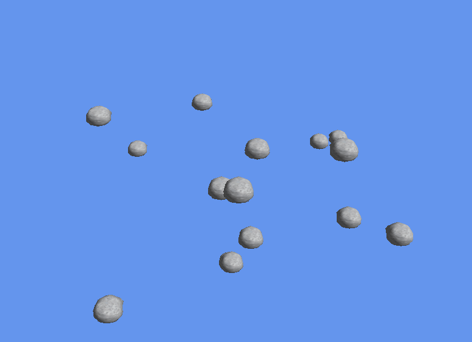

# OP-Directx12

**Instalación:** como siempre hemos hecho, tendremos que moverlos los assets a la carpeta de Debug -> AppX que se generará cuando compilemos y ejecutemos el código en visual studio.

El asteroide lo he modelado en Blender y he consultado para su realización los tutoriales de clase y el libro Introduction to 3D Game Programming with DirectX 12 de Frank Luna.

